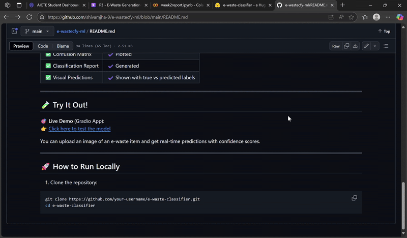

# ♻️ E-Waste Image Classification using EfficientNetV2B0 (Transfer Learning)


This project uses **EfficientNetV2B0**, a powerful deep learning model, to automatically classify electronic waste (e-waste) images into 10 distinct categories. It supports automation in recycling by replacing manual, error-prone sorting with an AI-powered solution.

[](https://huggingface.co/spaces/Shivamjha09/e-waste-classifier)

---

## 🔍 Problem Statement

E-waste is one of the fastest-growing waste streams globally. Accurate and automated categorization of e-waste is crucial for:
- Efficient recycling
- Safe disposal
- Reducing environmental harm

---

## 🎯 Project Goal

> **To build an AI-powered image classifier that can detect and label e-waste items using a pre-trained EfficientNetV2B0 model with transfer learning.**

---

## 📂 Dataset

The dataset includes 10 categories of e-waste:

- 📱 Mobile
- 🔋 Battery
- 🖨️ Printer
- 📺 Television
- 🖱️ Mouse
- ⌨️ Keyboard
- 🧼 Washing Machine
- 🔊 Player
- 🔌 PCB
- 🔥 Microwave

---

## 🧠 Model Architecture

- ✅ **Base Model**: `EfficientNetV2B0` (pre-trained on ImageNet)
- ✅ **Input Size**: 128x128 RGB images
- ✅ **Layers Added**:
  - Data Augmentation
  - Global Average Pooling
  - Dropout
  - Dense Softmax layer for 10-class output

---

## 🛠️ Technologies Used

| Tool | Purpose |
|------|---------|
| **TensorFlow** | Deep learning framework |
| **Keras** | Model building and training |
| **Gradio** | Web interface for model deployment |
| **Hugging Face Spaces** | Hosting the live app |
| **Matplotlib / Seaborn** | Visualizations |
| **Scikit-learn** | Evaluation metrics |

---

## 📊 Evaluation Metrics

| Metric | Value |
|--------|-------|
| ✅ Test Accuracy | ~94% |
| ✅ Confusion Matrix | ✔️ Plotted |
| ✅ Classification Report | ✔️ Generated |
| ✅ Visual Predictions | ✔️ Shown with true vs predicted labels |

---

## 🎞️ App Preview



---

## 🚀 How to Run Locally

```bash
git clone https://github.com/shivamjha-9/e-waste-classifier.git
cd e-waste-classifier
pip install -r requirements.txt
python app.py
```

---

## 📦 Requirements

```txt
gradio
tensorflow
numpy
Pillow
```

---

## ☁️ Deployment

This project is deployed on [Hugging Face Spaces](https://huggingface.co/spaces/Shivamjha09/e-waste-classifier) using Gradio.

Steps:
- Save the model as `.keras`
- Write an `app.py` Gradio interface
- Add `requirements.txt`
- Run `gradio deploy` and follow instructions

---

## 🙋‍♂️ Author

**Shivam Kumar Jha**  
📧 sjrk000107@gmail.com  
🔗 [LinkedIn](https://www.linkedin.com/in/shivam-jha-a80825291)  
👨‍💻 [GitHub](https://github.com/shivamjha-9)

---

## 📄 License

This project is licensed under the MIT License.
